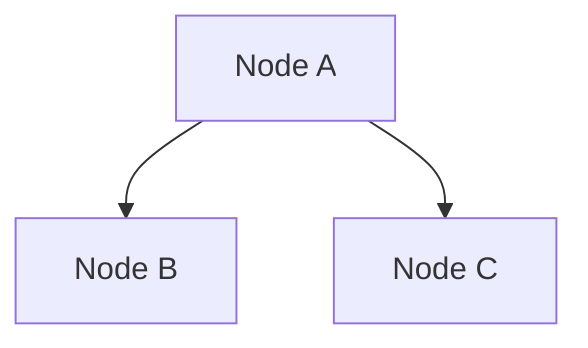

---
tags:
  - tignore
---
# Heading 1
## Heading 2
### Heading 3
#### Heading 4
##### Heading 5
###### Heading 6

Far far away, behind the word mountains, far from the countries _Vokalia and Consonantia_, there live the **blind** texts. Separated they live in Bookmarksgrove right at the coast of the Semantics, [a large language ocean](https://example.com). A small river named Duden flows by their place ~~and supplies it with the necessary regelialia~~. It is a paradisematic country, in which roasted parts of ==sentences fly into your mouth==.

```php
$var = "this is a string"
if (str_contains($var, "this")) {
	return "it has 'this'"
}
```

- [ ] `- [ ]` To-do
- [/] `- [/]` Incomplete
- [x] `- [x]` done
- [-] `- [-]` cancelled
- [>] `- [>]` Forwarded
- [<] `- [<]` Scheduling

- [?] `- [?]` Question
- [!] `- [!]` Important
- [*] `- [*]` Star
- ["] `- ["]` Quote
- [l] `- [l]` Location
- [b] `- [b]` Bookmark

- [i] `- [i]` Information
- [S] `- [S]` Savings
- [I] `- [I]` Idea
- [p] `- [p]` Pros
- [c] `- [c]` Cons
- [n] `- [n]` Notes

- [ ] Time Sensitive [Due:: 2024-01-01]

| Column A | Column B |
| --- | ---|
| Cell 1A | Cell 1B |
| Cell 2A | Cell 2B |

> [!info]
> Calling out some info! there are lots of types like:
>  - note
>  - abstract
>  - info
>  - todo
>  - tip
>  - success
>  - question
>  - warning
>  - failure
>  - danger
>  - bug
>  - example
>  - quote

> [!tip]- Callouts can have custom titles
> Like this one. This one is even foldable!

---

Diagrams can be made using [mermaid-js](https://mermaid.js.org/).

%%
Obsidian also supports comments, so these don't get rendered in reading mode.
%%


